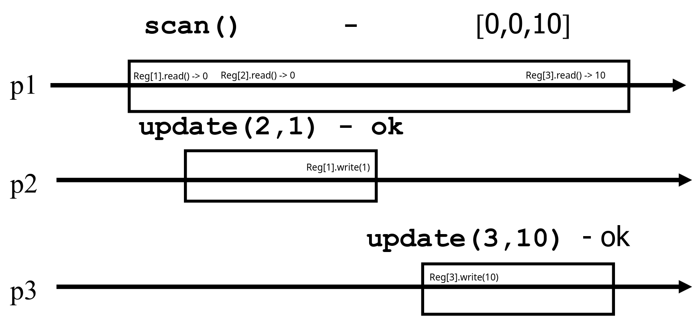

These are my lecture notes and comments for the [Concurrent Computiong](https://edu.epfl.ch/studyplan/en/master/computer-science/coursebook/concurrent-computing-CS-453) course at EPFL. The reference for these notes are prof. Rachid Guerraoui’s lectures and his book [Algorithms for Concurrent Systems](https://www.amazon.com/Algorithms-for-concurrent-systems/dp/2889152839). I have tried to reformulate some proofs in order to better understand the subject. This post deals with more advanced topics than locking, it's main concern is to implement wait-free concurrent algorithms.

## Assumptions

### Process

Processes model a sequential program, which means that, after invoking an operation op1 on some object O1, a process does not invoke a new operation (on the same or on some other object) until it receives the reply for op1.. In our model we assume that there are N processes which are unique and know each other. Additionally, a process either executes the algorithm assigned to it or crashes without ever recovering.

A process that doesn't crash in a given execution is considered correct.n (on the same or on some other object) until it receives the reply for op1.

### Safety

Safety properties stipulate that nothing bad should happen. A property that can be violated at some time point T and never be satisfied again is a safety property.

Example: not lying

### Liveness

Liveness properties stipulate that something good should happen. At any time T there is some hope that the property can be satisfied at a later time T' >= T.

Example: saying anything

It is trivial to have one without the other, however, the hard part (i.e telling the truth) is satisfying both.

### Wait Freedom

Any correct process that invokes an operation eventually gets a reply, no matter what happens to the other processes (very slow or crash)

### Atomicity (Linearizability)

Every operation appears to execute at some indivisible point in time (called linearization point) between the invocation and reply time events.

## Registers

Registers are simple object on which we can perform `read()` or `write(value)` operations.

### Register Types

Based on value:

- Binary: containt 1 bit (0 or 1)
- Multi-valued: contain any value from an infinite set (bounded or unbounded)

Based on the number of concurrent processes:

- Single reader, single writer - SRSW
- Multiple readers, single writer - MRSW
- Multiple readers, multiple writers - MRMW

Based on concurrency guarantees:

- Safe
- Regular
- Atomic

### Safe register

Safety: A read that is not concurrent with a write returns the last written value. A safe register ensures safety. It only supports a single writer.


### Regular register

Regularity: A read that is concurrent with a write returns the value written by that write or the value written by the last preceding write. A regular register ensures regularity and safety. It only supports a single writer.

Read-write inversion: when two consecutive (non-overlapping) reads are concurrent with a write, it is possible for a regular register to return the newely written value on the first read and the previously written value on the second read.


### Atomic register

Atomicity: An atomic (linearizable) register is one that ensures linearizability. Such a register ensures the safety and regularity properties above, but in addition, prevents the situation of read-write inversion. The second read must succeed the first one in any linearization, and thus must return the same or a "newer" value.


## Register Reductions

### From (binary) SRSW safe register to (binary) MRSW safe register

We use an array of SRSW registers Reg[1...N], one per reader process.

```javascript
Read() {
    return (Reg[i].read());
}

Write(v) {
    for j in range(1, N)
        Reg[j].write(v);
}
```

Proof Assume first that base 1W1R registers are safe. It follows directly from the algorithm that a read of R (i.e., R. read() ) that is not concurrent with a R. write() operation returns the last value deposited in the register R. The obtained register R is consequently safe while being 1WMR.

Let us now suppose that the base registers are regular. We will argue that the high-level register R constructed by the algorithm is a 1WMR regular one. Since a regular register is safe, the argument above implies that R is safe.

Hence, we only need to show that a read operation R. read() that is concurrent with one or more write operations returns a concurrently written value or the last written value. Let pi be any process that reads some value from R. When pi reads the base regular register REG[i] pi returns (a) the value of a concurrent write on REG[i] (if any) or (b) the last value written to REG[i] before such concurrent write operations. If the concurrent write R.write(v) managed to call Reg[i].write(v), then the concurrent read Reg[i].read() will return either the new value or the last written value. Otherwise, if the Reg[i].read() and Reg[i].write(v) aren't concurrent, due to the safety property, the Reg[i].read() will return the last written value. Therefore the register is regular.

- Works for building MRSW safe register from SRSW safe register.
- Works for building MRSW regular register from SRSW regular register.
- Does not work for atomic register.

### From binary MRSW safe to binary MRSW regular

We use one MRSW safe register

```javascript
Read() {
    return Reg.read();
}

Write(v) {
    if old != v {
        Reg.write(v);
        old = v;
    }
}
```

Since the underlying base register is safe, a read that is not concurrent with any write returns the last written value.

Now consider a read operation r that overlaps with one or more write operations. If none of these operations change the value of the register, i.e. write to the underlying base safe register `Reg`, we are back to the previous case, as the read of `Reg` performed by r does not overlap with any write on `Reg`.

Now suppose that a concurrent operation changes the value of `Reg`. Thus, the value written by the last write that precedes r is different from the value written by the concurrent write. BUt the range of these values is {0, 1}. SInce the read on the underlying base register returns a value in the range to any read, any of these values are accepted by the regularity conditions. Therefore the high-level register is regular.

- Works for single reader registers
- Doesn't work for multi-valued registers
- Doesn't work for atomic registers

### From binary to M-valued MRSW regular

We use an array of MRSW Registers Reg[0 ... M] initialized to [1,0,...,0].

- The value `v` is represented by 0s in registers `1` to `v - 1` and then `1` in register at position `v`.

```javascript
Read() {
    for j in range(0, M) {
        if Reg[j].read() == 1
            return j;
    }
}

Write(v) {
    Reg[v].write(1);
    for j in range(v - 1, 0) {
        Reg[j].write(0);
    }
}
```

Proof A R. write(v) operation trivially terminates in a finite number of its own steps: the for loop only goes through v iteration.

To see that a R. read() operation terminates in at most v iterations of the while loop, observe that whenever the writer changes sets REG[x] from 1 to 0, it has previously set to 1 another entry REG[y] such hat x < y ≤ b. Therefore, if a reader reads REG[x] and returns the new value 0, then a higher entry of the array is set to 1. As the running index of the while loop starts at 1 and is incremented each time the loop body is executed, it follows that the loop always terminates, and the value j it returns is such that 1 ≤ j ≤ b.

Proof Consider first a read operation that is not concurrent with any write, and let v be the last written value. By the write algorithm, when the corresponding R. write(v) terminates, the first entry of the array that equals 1 is REG[v] (i.e., REG[x] = 0 for 1 ≤ x ≤ v − 1). Because a read traverses the array starting from REG[1], then REG[2], etc., it necessarily reads until REG[v] and returns the value v.

Let us now consider a read operation R. read() that is concurrent with one or more write operations R. write(v1), . . ., R. write(vm) (as depicted in Figure 4.7). Let v0 be the value written by the last write operation that terminated before the operation R. read() starts. For simplicity we assume that each execution begins with a write operation that sets the value of R to an initial value. As a read operation always terminates (Lemma 2), the number of writes concurrent with the R. read() operation is finite. By the algorithm, the read operation finds 0 in REG[1] up to REG[v −1], 1 in REG[v], and then returns v. We are going to show by induction that each of these base-object reads returns a value previously or concurrently written by a write operation in R. write(v0), R. write(v1), . . ., R. write(vm). Since R. write(v0) sets REG[v0] to 1 and REG[v0 − 1] down to REG[1] to 0, the first base-object read performed by the R. read() operation returns the value written by R. write(v0) or a concurrent write. Now suppose that the read on REG[j], for some j = 1, . . . , v − 1, returned 0 written by the latest preceding or a concurrent write operation R. write(vk) (k = 1, . . . , m). Notice that vk > j: otherwise, R. write(vk) would not touch REG[j]. By the algorithm, R. write(vk) has previously set REG[vk] to 1 and REG[vk − 1] down to REG[j + 1] to 0. Thus, since the base registers are regular, the subsequent read of REG[j + 1] performed within the R. read() operation can only return the value written by R. write(vk) or a subsequent write operation that is concurrent with R. read(). By induction, we derive that the read of REG[v] performed within R. read() returns a value written by the latest preceding or a concurrent write.

- Doesn't work for atomic registers.
  Consider that the register had a value 10, and then the writer did 2 writes w(1) and then w(9). The first read r1 is concurrent with both writes, it missed the first one so it continues to read, but very slowly. Then w(1) completes and the second write w(9) starts and writes a 1 at 9 and starts clearing. The read r1 now manages to find the 1 at 9 and then returns 9. The read r2 starts now and finds a 1 at 1 from w(1) and returns 1. This is read write inversion.

### From SRSW regular to SRSW atomic

For this, we need an "unbounded" sequence number. This is not very realistic, however, there are techniques to recycle the timestamps of bounded sequence numbers, so that they appear unbounded.

Generally, each register will contain, along the data, a sequence number or a timestamp.

```javascript
Read() {
    (timestamp, value) = Reg.read();
    if timestamp > last_timestmap {
        last_timestamp = timestamp;
        last_value = value;
    }

    return last_value;
}

Write(value) {
    timestamp++;
    Reg.write(value, timestamp);
}
```

Safety: trivial.
By memorizing the `last_timestamp` and `last_value` in the reader, we can prevent a read inversion, as the first read will update the `last_timestamp` and `last_value`, therefore, when the second read happens, it will read a lower `timestamp` and will just return the `last_value`.

Doesn't work for multiple readers, because the second reader doesn't have the updated `last_timestamp` and `last_value`, therefore, a read inversion could still happen.

### From SRSW atomic to MRSW atomic

If we tried the simple transformation with N SRSW atomic registers, one for each reader:

```javascript
Read() {
    (timestamp, value) = Reg.read();
    if timestamp > last_timestmap {
        last_timestamp = timestamp;
        last_value = value;
    }

    return last_value;
}

Write(value) {
    timestamp++;
    for j in range(1,N) {
        Reg[j].write(value, timestamp);
    }
}
```

This will not be atomic. Consider 3 processes, pw - writer process, p1 - reader process and p10 - reader process. The writer starts writing a value `x` to the register and overwrites the `Reg[1]`. Concurrent to the write, p1 reads and returns the new value `x`, but the writer still hasn't managed to overwrite the `Reg[10]`, so when the p10 reads, it will return the old value. This unfortunately violates atomicity as `Reg[10]` would have to return the new value `x` as well.

In order to make this atomic, we will need to have communication between each two readers, by using the atomic SRSW registers. Thus, we would need N2 registers. In `ReadReg[i][j]`, the reader is pi and the writer is pj.

```javascript
Read() {
    for j in range(1, N) {
        (timestamp[j], value[j]) = ReadReg[i][j].read();
    }

    (timestamp[0], value[0]) = WriteReg[i].read();
    (timestmap, value) = (timestamp[k], value[k]) where timestamp[k] = max(timestamp);

    for j in range(1,N) {
        ReadReg[j][i].write(value, timestamp);
    }

    return value;
}


Write(value) {
    timestamp := timestamp + 1;
    for j in range(1,N) {
        WriteReg[j].write(value, timestamp);
    }
}
```

It would not work for multiple writers, as they compute timestamp locally. For example, let's say that writer p1 wrote 5 times, eat means it's current timestamp is 5. Now, let's say that p2 wrote, it's timestamp would now be 1. How would the reader now which timestamp is correct? If it returns the maximum timestamp it would incorrectly return old value (violates safety).

### From MRSW atomic to MRMW atomic

Following the intuition from the previous example, we need to have communication between the writers as well.
We use N MRSW atomic registers, the writer of `Reg[i]` is pi.

```javascript
Read() {
    for j in range(1,N) {
        (timestamp[j], value[j]) = Reg[j].read();
    }
    (timestamp, value) = (timestamp[k], value[k]) where timestamp[k] = max(timestamp) and k is max;

    return value;
}

Write() {
    for j in range(1,N) {
        (timestamp[j],value[j]) = Reg[j].read();
    }

    (timestamp, value) = (timestamp[k], value[k]) where timestamp[k] = max(timestamp);


    timestamp = timestamp + 1;
    Reg[i].write(timestamp, value);
}
```

We need to choose the maximum (or minimum) such k, so that two concurrent write operations don't choose the same sequence number. For example, assume we have two processes which write, p1 and p2. They write concurrently the values `1` and `2` respectively. Because the neither one completes the write operation before the other one reads, the resulting registers look like this: `Reg = [(timestamp: 1, value: 1), (timestamp: 1, value: 2)]`. Now, we have 2 reads which happen sequentially one after another. If we don't impose the ordering, the first read could read the value 1, the second value 2. This would violate safety, as the reads which are not concurrent with a write would have to return the last written value (which should be the same).

With the ordering, it is atomic, because the only case when we can possibly return different values on reads are when maximum timestamp is not unique. However, the ordering property will always force us to pick the same timestamp in this situation, thus we will always return the same value. Therefore, a read write inversion is not possible.

Safety and regularity are trivially satisfied.

## Impossibility Results

In this chapter we will prove some impossibility results and complexity lower bounds for making atomic registers from base safe registers.

### Bound on SRSW atomic register implementations

There is no wait-free algorithm that:

1. Implements a SRSW atomic register
2. Uses a **finite** number of **bound** SRSW regular registers
3. Where the base registers can only be written by the writer

Without loss of generality, we can assume:

1. The higher-level register is binary
2. Instead of finitely many SRSW regular registers, there is only one SRSW regular register (called reg) - say we had N registers, then the big register will hold N bits, each representing one register.

Adverserial example:
Writer alternates between writing `0` and `1` on the atomic register infinite times.

The implementing algorithm uses finite number of registers - `M`, each holding `0` or `1`, which means there are 2M different values. Say that in the given sequence, each different value written to the underlying register is written at most `X` times, that means that there are `2^M* X` writes, which is not possible since there are infinite number of writes. Hence, when a `Write(0)` occurs, there has to be a value v0 which occurs an infinite amount of times. Similarly, there has to be a value vn which occurs an infinite amount of times when doing a `Write(1)` operation.

Let's say that when writing a 1, the register goes through some kind of a sequence of values from v0 to vn. This sequence might not be the same every time, however, analogous to the previous argument, there will have to be some sequence of value changes from such that it repeats infinitely often (as otherwise we would have to have an infinite number of written values, but the registers are bounded) - let that sequence be v0, v1, ... , vn.

Let's say that we schedule a long write, and reads to happen inbetween underlying value writes vi and vi + 1 (after vi and before vi + 1). At some point, one of these writes has to cause the reader to read a 1, let the value written before such write be vi (it may happen multiple times, but at least once, otherwise, we would not be able to write anything into the register).

Now, we can schedule two consecutive reads - r1 and r2 to be concurrent to the write vi + 1. Because of the regular property of the underlying registers, both reads can return the previous written value vi or the current value vi + 1. Therefore, r1 can read vi + 1 and then r2 can read vi, causing a read inversion which breaks atomicity.


In case it was v1 causing the read to read a 1, then the r2 will read v0 as the previous value, while r1 can read v1.


In case it was v1 causing the read to read a 1, then the r2 will read v0 as the previous value, while r1 can read v1.


### Bound on MRSW atomic register implementations

There is no wait-free algorithm that:

1. Implements a MRSW atomic register,
2. Uses any number of SRSW atomic registers,
3. And where the base registers can only be written by the writer

Proof:

Let's assume that this is true for 1 writer and 2 readers, because if it is, then it will be true for any greater number of multiple readers as well.

If the algorithm `A` uses an any number of SRSW atomic registers, then it is the same as having 1 register per reader, same proof as in the regular to atomic impossibility result.

We also assume that it is true for "binary" registers, therefore it would hold true for M-valued registers as well.

MRSW register `atom` initially has `0`. Consider the `atom.Write(1)` operation.

`w1, ..., wn` are individual writes to the SRSW registers (one at a time). If the writer is communicating with reader `r` (i.e writing to his register), then the reader `r'` will not see this and will always return the same value, and vice-versa.

Because the readers have to read `0` before the write and `1` after the write. Therefore, there is some `i`, `j`, `i != j` for which `ri = 0` and `ri+1 = 1`, and, `r'j = 0` and `r'j + 1 = 1`, because `w1, ..., wn` are writes to separate registers (cannot communicate with both readers at the same time).

Let's assume, without loss of generality that `i < j`. Then, if we schedule the reader `r` to read after `i`, then it will have to return `1`. Afterwards, we can schedule the reader `r'` to read, however, because the write was happening to the `r`'s register, then, for the reader `r'` it's as if the write never happened, therefore, it would have to read the value that was before the write, which is `r'i`. Since, the reader's return value changes at `r'j+1`, where `j > i`, therefore, the reader `r'` reads a `0` and we have a read inversion.


To conclude, readers must communicate in order to implement an MRSW atomic register from SRSW atomic registers.

## The power of registers

In this chapter, we will discuss what is possible to implement just with registers and what isn't.

### Counter

A counter has two operations `inc()` and `read()` and maintains an integer `x` initialized to `0`.

Naive implementation with just 1 register:

```javascript
read() {
    return Reg.read();
}

inc() {
    temp:= Reg.read() + 1;
    Reg.write(temp);
    
    return ok;
}
```

However, this implementation is not correct, because 2 processes which call the `inc()` operation concurrently could both read `0` from the register and then write `1` to it, therefore, the result is `1` instead of `2`.

To implement an atomic counter, the processes share an array of registers `Reg[1 ... N]`:

```javascript
inc() {
    Reg[i].write(Reg[i].read() + 1);
    return ok;
}

read() {
    sum = 0;
    for j in range(1,N) {
        sum = sum + Reg[j].read();
    }

    return sum;
}
```

With this implementation, even when we have concurrent `inc()` operations, the processes write to their own register, so it is not possible to have the processes read the same counter value while incrementing. When calling `read()`, it is not possible to have a read inversion, because this would mean that there exists a register `k` such that the first reader read the "newely" incremeneted value, while the second reader read the old value. This is not possible, as the register themselves are atomic.

### Snapshot

A snapshot has operations `update()` and `scan()` and maintains an array `x` of size `N`.

```javascript
scan() {
    return x;
}

update(i, value) {
    x[i] = value;

    return ok;
}
```

Naive implementation - processes share one array of N atomic registers `Reg[1 ... N]`:

```javascript
scan() {
    for j in range(1, N) {
        x[j] = Reg[j].read();
    }

    return x;
}

update(i, value) {
    Reg[i].write(value);

    return ok;
}
```

The problem with this implementation is that it is possible for a slow read to return an array which wasn't "written" at any point in time.



In order to implement an atomic snapshot, we will first implement an operation `collect`, which returns, for ever index of the snapshot, the last written values or the value of any concurrent update (the same as the `scan` operation in naive implementation).

Now, in order to successfully `scan`, the process keeps calling `collect` until two consecutive results are the same. This means that the snapshot did not change and it is safe to return without violating atomicity.

The processes share one array of `N` atomic registers `Reg[1 ... N]`, each containing a value and a timestamp.

```javascript
collect() {
    for j in range(1, N) {
        x[j] = Reg[j].read();
    }

    return x;
}

scan() {
    last = this.collect();
    while(true) {
        current = this.collect();
        if (last == current) {
            return last.value;
        }
        last = current;
    }
}

update(value) {
    timestamp = timestamp + 1;
    Reg[i].write(value, timestamp);

    return ok;
}
```

Here, we need the timestamps, because if some writer updates the register to a new value, and then to an old one, the reader could collect the same values before and after the updates and terminate, not knowing that a write occured in between. This is problematic as given in the following example:


This implementation is atomic, however, it is not wait-free, because a process that reads could, in theory, never return if there are infinite concurrent writes.

To implement a wait-free snapshot, the processes share an array of registers `Reg[1 ... N]` that each contain:

- a value
- a timestamp
- a copy of the entire array of values

To `scan`, a process keeps collecting and returns a `collect` if it did not change, or some `collect` returned by a concurrent `scan`. Timetamps are used to check if the `collect` changes or if a scan has been taken in the meantime.

To `update`, a process calls `scan` and writes the value, the new timestamp and the result of the `scan`.

```javascript
update(i, value) {
    timestamp = timestamp + 1;
    Reg[i].write(value, timestamp, this.scan());

    return ok;
}

scan() {
    t1 = this.collect();
    t2 = t1;

    while (true) {
        t3 = this.collect();
        if (t3 == t2) {
            return t3.value;
        }

        for j in range(1, N) {
            //this means that a process ran 2 update operations
            //concurrently with the current scan operation
            //As a result, the second update operation (t3)
            //must have completed entirely within scan
            //(because the process can see that the value changed before it
            //hence the update operation must have started afterwards i.e
            //after the process started scanning).
            //This means that we can return the scan of that update operation.
            if (t3[j].timestamp >= t1[j].timestamp + 2) {
                return t3.array;
            }
        }

        t2 = t3;
    }
}
```

## Consensus

A consensus object makes a set of processes decide on a value. It has one operation: `propose` which returns a value. When a propose oepration returns, we say that the process decides. It has 3 properties:

1. Aggreement - no two processes decide different values
2. Validity - a decided value has to have been proposed by some process.
3. Termination - Every correct process eventually decides a value.

### LA (FLP) Impossibility

No asynchronous deterministic algorithm, implements consensus among two processes using only registers.

Proof: Consider two processes `p0` and `p1` and any number of registers, `R1`,...,`Rk`,... . Assume that a consensus algorithm A for `p0` and `p1` exists.

Initial configuration C is a set of (initial) values of `p0` and `p1` together with the values of the registers `R1`,...,`Rk`,... .

A step is an elementary action executed by some process `pl`: it consists in reading or writing a value in a register and changing `pl`'s state according to the algorithm A.

A schedule S is a sequence of steps; S(C) denotes the configurations that results from applying S to C. In an asynchronous environment, there are no constraints on the schedules (i.e any sequence of steps is a valid schedule).

A configuration C is 0-valent if, starting from C, no matter how the processes behave, no decision other than 0 is possible. Similarly for 0-valent configuration. If a configuration isn't 1-valent or 0-valent, then it is bivalent.

Lemma 1: there is at least one initial bivalent configuration

Proof: The initial configuration C(0,1) is bivalent. If we start from configuration C(0,0) and then choose a schedule where `p1` doesn't take any steps until `p0` decides (it must eventually decide because of the termination property of A), then `p0` must decide `0`. This is true if we apply the same schedule for the starting configuration C(0,1), since `p0` cannot distinguish the configuration C(0,1) from C(0,0) if `p1` is never scheduled. Similarly, if we start with the configuration C(1,1) and never schedule `p0`, then `p1` must eventually decide `1`. This is again true for the configuration C(0,1), since `p1` cannot distinguish it from the configuration C(1,1) if `p0` is never scheduled. Therefore, configuration C(0,1) is bivalent.

Lemma 2: Given any bivalent configuration C, there is an arbitarily long schedule S such that S(C) is bivalent.

Proof: Let S be the schedule with the maximum length such as D = S(C) is bivalent. p0(D) and p1(D) are both univalent: one of them is 0-valent (say p0(D)) and the other is 1-valent (say p1(D)). To go from D to p0(D), `p0` accesses a register R which must be the same in both cases, otherwise p1(p0(D)) is the same as p0(p1(D)), because they access diferent registers, hence the order doesn't matter. This is in contradiction with the very fact that p0(D) is 0-valent whereas p1(D) is 1-valent.

To go from D to p0(D), p0 cannot read R, otherwise R has the same state in D and in p0(D). In this case, the registers and p1 have the same state in p1(p0(D)) and p1(D) (because p0 just reads R and doesn't write to it to communicate to `p1`). If `p1` is the only one executing steps, then `p1` eventually decides `1` in both cases, which is a contradiction with the fact that p0(D) is 0-valent. Similarly, `p1` cannot read R to go from D to p1(D).

Thus both `p0` and `p1` write in R to go from D to p0(D), however, in that case p0(p1(D)) = p0(D) (because they overwrite each other). If `p0` is the only one executing steps, then `p0` eventually decides `0`, which is a contradiction to the 1-valencyu of p1(D). Analogous p1(p0(D)) = p0(D), which is also a contradiction.

By using lemmas 1 and 2, there exists a bivalent initial configuration C and an infinite schedule S such that, for any prefix S' of S, S'(C) is bivalent. In an infinite schedule S, at least one process executes an infinite number of steps and does not decide, which is a contradiction to the termination property of A.

## The limitations of registers

After thoroughly learning about registers, here we'll present (and prove) some object which cannot be implemented with registers.

### Fetch and Increment

Operation `fetch_and_increment` increments the counter and returns the new value.

Sequential specification:

```javascript
fetch_and_increment(){
    counter = counter + 1;
    return counter;
}
```

To prove that fetch and increment cannot be implemented only by using registers, we will implement consensus by using fetch&inc and registers. Since consensus cannot be implemented by using only registeres, the same applies to fetch&inc, otherwise, we would be able to swap the fetch&inc object with the registers and algorithm that implement it, and then implement the consensus by only using registers.

This implementation of 2-consensus uses fetch&inc object FC and 2 registers.

```javascript
propose(value) {
    Reg[i].write(value);
    val := FC.fetch_and_inc();

    //if the process is the "winner"
    if val == 1 {
        return value;
    } else {
        //reads the register of the other process
        return Reg[1 - i].read();
    }
}
```

### Queue

Again, we will implement consensus by using a queue and show that an atomic wait-free queue cannot be implemented by using only registers.

We wiil use two register and a queue which is initialized to `{winner, loser}`.

```javascript
propose(value) {
    Reg[i].write(value);

    val = q.dequeue();

    if val == winner {
        return value;
    } else {
        return Reg[1 - i].read();
    }
}
```

### Test and set

The test and set object sets it value to `1` and returns the old value.

```javascript
test_and_set() {
    y = x;
    x = 1;

    return y;
}

set_state(value) {
    x = value;
}
```

Locking with test and set:

```javascript
lock() {
    while 1 == test_and_set();
}

unlock() {
    set_state(0);
}
```

2-consensus uses two registers and a test&set object T.

```javascript
propose(value) {
    Reg[i].write(value);

    val = T.test_and_set();

    if val == 0 {
        return value;
    } else {
        return Reg[1 - i].read();
    }
}
```

### Compare and swap

The c&s object compares if it's value is equal to the old value, and if it is sets the value to the new value. It return it's value before the change.

```javascript
compare_and_swap(old_value, new_value) {
    y = x;
    if x == old_value
        x = new_value;

    return y;
}
```

Locking with c&s:

```javascript
lock() {
    while LOCKED == compare_and_swap(UNLOCKED, LOCKED);
}

unlock() {
    compare_and_swap(LOCKED, UNLOCKED);
}
```

Unlike other mentioned objects, the compare and swap object can implement consensus with an infinite number of processes (fetch&inc, queue and test&set can implement consensus with only 2 processes).

The implementation uses only a compare and swap object CS initialized to `winner` (here winner is chosen as it is easier to explain the algorithm, however, usually a C&S object will be initialized to some "falsy"/"empty" value).

```javascript
propose(value) {
    val = CS.compare_and_swap(winner, value);

    if val = winner {
        return value;
    } else {
        return val;
    }
}
```
