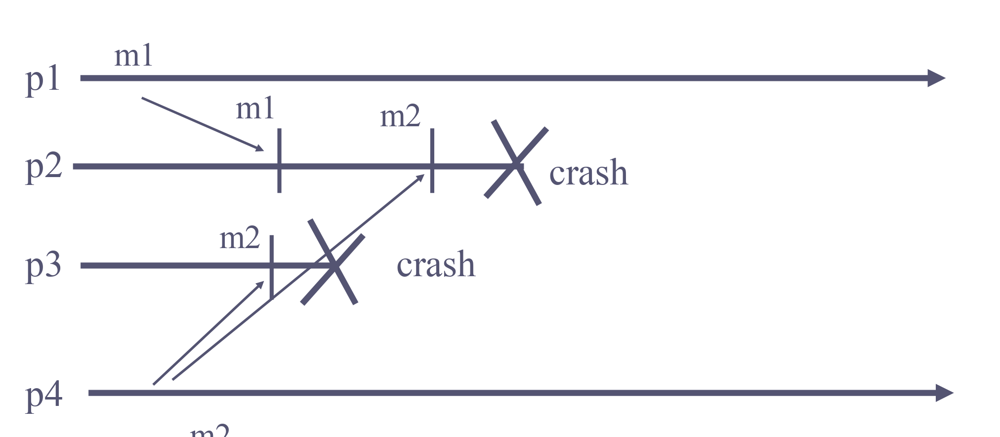
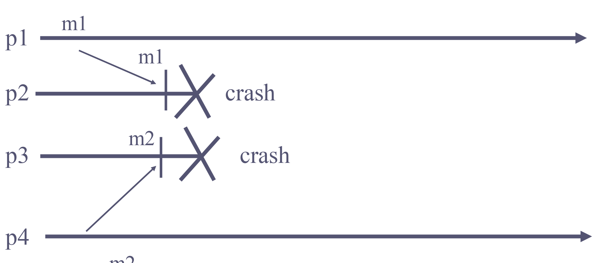
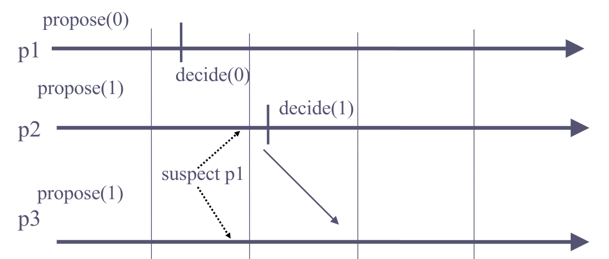
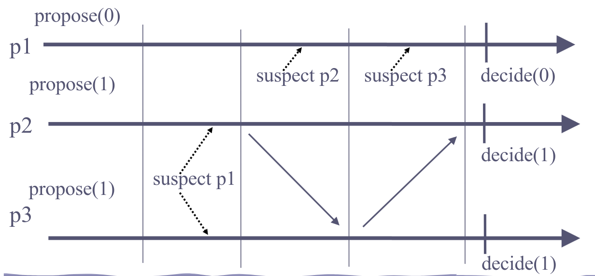
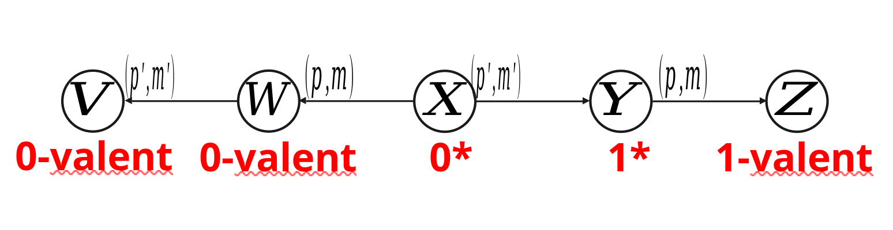
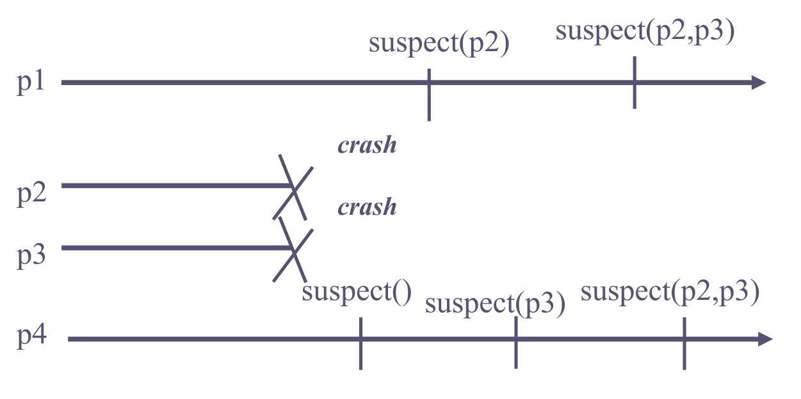
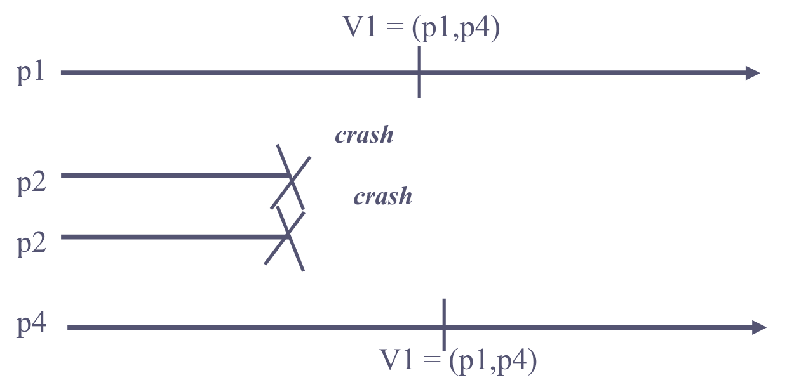
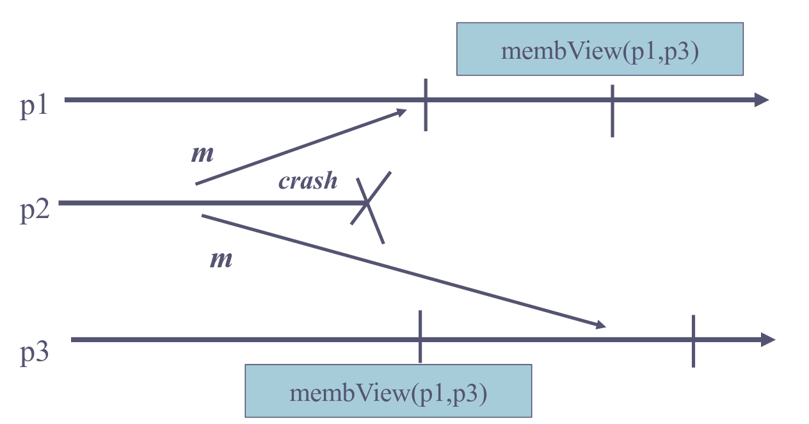

These are my lecture notes and comments for the [Distributed Algorithms](https://edu.epfl.ch/studyplan/en/master/computer-science/coursebook/distributed-algorithms-CS-451) course at EPFL. The reference for these notes are prof. Rachid Guerraoui's lectures and his book [Introduction to Reliable and Secure Distributed Programming](https://link.springer.com/book/10.1007/978-3-642-15260-3). I have tried to reformulate some proofs in order to better understand the subject. This post should be enough to get some basic understanding on distributed systems, for more advanced concepts, please consult the book.

With that in mind, we can begin.

## Assumptions

### Process

Processes model a sequential program. In our model we assume that there are N processes which are unique and know each other. They are connected by links through which they exchange messages. Finally, modules within the same process interact by exchanging events.

### Safety

Safety properties stipulate that nothing bad should happen. A property that can be violated at some time point T and never be satisfied again is a safety property.

Example: not lying

### Liveness

Liveness properties stipulate that something good should happen. At any time T there is some hope that the property can be satisfied at a later time T' >= T.

Example: saying anything

It is trivial to have one without the other, however, the hard part (i.e telling the truth) is satisfying both.

### Failure

Here we will talk about 3 kinds of failures:

- Omission: the process omits to send messages it is supposed to send
- Arbitary: the process sends messages it is not uspposed to send (malicious or Byzantine)
- Crash stop: A process that omits a message to a process, omits all subsequent messages to all processes

## Links

### Fair-loss links

1. Fair-loss: If a message is sent infintely often by p<sub>i</sub> to p<sub>j</sub> and neither p<sub>i</sub> or p<sub>j</sub> crashes, then m is delivered infinitely often by p<sub>j</sub> (Liveness)
2. Finite duplication: If a message m is sent a finite number of times by p<sub>i</sub> to p<sub>j</sub> m is delivered a finite number of times by p<sub>j</sub> (Liveness)
3. No creation: No message is delivered unless it was sent (Safety)

### Stubborn links

1. Stubborn delivery: If a process p<sub>i</sub> sends a message m to a correct process p<sub>j</sub> and p<sub>i</sub> does not crash, then p<sub>j</sub> delivers m an infinite number of times
2. No message is delivered unless it was sent

```dapseudo
Implements: StubbornLinks (sp2p)
Uses: FairLossLinks(flp2p)

upon event <sp2pSend, dest, m> do
    while (true) do
        trigger <flp2pSend, dest, m>;

upon event <flp2pDeliver, src, m> do
    trigger <sp2pDeliver, src, m>;
```

### Reliable (Perfect) links

1. Validity: If p<sub>i</sub> and p<sub>j</sub> are correct, then every message sent by p<sub>i</sub> to p<sub>j</sub> is eventually delivered by p<sub>j</sub>
2. No duplication: No message is delivered (to a process) more than once
3. No creation: No message is delivered unless it was sent

```dapseudo
Implements: PerfectLinks (pp2p)
Uses: StubbornLinks (sp2p)

upon event <Init> do
    delivered := ∅

upon event <pp2pSend, dest, m> do
    trigger <sp2pSend, dest, m>;

upon event <sp2pDeliver, src, m> do
    if m ∉ delivered then
        trigger <pp2pDeliver, src, m>;
        add m to delivered;
```

## Failure Detection

### Perfect Failure Detector

1. Strong Completeness: Eventually, every process that crashes is permanently suspected by every correct process
2. Strong Accuracy: No process is suspected before it crashes

### Eventually Perfect Failure Detector

1. Strong Completeness
2. Eventual Strong Accuracy: Eventually, no correct process is ever suspected

```dapseudo
1. Processes periodically send heartbeat messages
2. A process sets a timeout based on worst case round trip of a message exchange
3. A process suspects another process if it timeouts that process
4. A process that delivers a message from a suspected process revises its suspicion and double its time-out
```

## Timing Assumptions

### Synchronous

1. Processing: the time it takes for a process to execute a step is bounded and known
2. Delays: there is a known upper bound limit on the time it takes for a message to be received
3. Clocks: the drift between a local clock and the global real time clock is bounded and known

### Eventually Synchronous

The timing assumptions hold eventually

### Asynchronous

No assumption

## Reliable Broadcast

### Best-Effort Broadcast

With best-effort broadcast, the burden of ensuring reliability is only on the sender.

1. Validity: If p<sub>i</sub> and p<sub>j</sub> are correct, then every message broadcast by p<sub>i</sub> is eventually delivered by p<sub>j</sub>
2. No duplication: No message is delivered more than once.
3. No creation: No message is delivered unless it was broadcast

```dapseudo
Implements: BestEfforBroadcasts (beb)
Uses: PerfectPointToPointLinks (pp2p)

upon event <bebBroadcast, m> do
    forall pi ∈ S do
        trigger <p2pSend, pi, m>;

upon event <pp2pDeliver, pi, m> do
    trigger <bebDeliver, pi, m>;
```

### Regular Reliable Broadcast

1. Validity: If p<sub>i</sub> and p<sub>j</sub> are correct, then every message broadcast by p<sub>i</sub> is eventually delivered by p<sub>j</sub>
2. No duplication: No message is delivered more than once.
3. No creation: No message is delivered unless it was broadcast
4. Agreement: For any message m, if any correct process delivers m, then every correct process delivers m.

```dapseudo
Implements: ReliableBroadcast (rb)
Uses:
    BestEffortBroadcast (beb)
    PerfectFailureDetector (P)

upon event <Init> do
    delivered := ∅;
    correct := S;
    forall pi ∈ S do
        from[pi] := ∅;

upon event <rbBroadcast, m> do
    delivered := delivered U {m};
    trigger <rbDeliver, self, m>; // I don't think we need to deliver here.
    trigger <bebBroadcast, [Data,self,m]>;

upon event <crash, pi> do
    correct := correct \ {pi};
    forall [pj, m] ∈ from[pi] do
        trigger <bebBroadcast, [Data,pj,m]>;

upon event <bebDeliver, pi, [Data, pj, m]> do
    if m ∉ delivered then
        delivered := delivered U {m};
        trigger <rbDeliver, pj, m>;
        if pi ∉ correct then
            trigger <bebBroadcast,[Data,pj,m]>;
        else
            from[pi]:=from[pi] U {[pj,m]};
```

### Uniform Reliable Broadcast

1. Validity: If p<sub>i</sub> and p<sub>j</sub> are correct, then every message broadcast by p<sub>i</sub> is eventually delivered by p<sub>j</sub>
2. No duplication: No message is delivered more than once.
3. No creation: No message is delivered unless it was broadcast
4. Uniform Agreement: For any message m, if any process delivers m, then every correct process delivers m

Difference from reliable broadcast is that if ANY process delivers m, not if ANY CORRECT process deliver m.

```dapseudo
Implements: uniformBroadcast (urb)
Uses:
    BestEffortBroadcast (beb)
    PerfectFailureDetector (P)

upon event <Init> do
    correct := S;
    delivered := forward := ∅;
    ack[Message] := ∅;

upon event <crash, pi> do
    correct := correct \ {pi};

upon event <urbBroadcast, m> do
    forward := forward U {[self, m]};
    trigger <bebBroadcast, [Data, self, m]>;

upon event <bebDeliver, pi, [Data, pj, m]> do
    ack[m] := ack[m] U {pi};
    if [pj,m] ∉ forward then
        forward := forward U {[pj, m]};
        trigger <bebBroadcast, [Data, pj, m]>;

upon event (for any [pj,m] ∈ forward) <correct ⊆ ack[m]> and <m ∉ delivered> do
    delivered := delivered U {m}
    trigger <urbDeliver, pj, m>;
```

The `forward` set contains the messages that are currently waiting for acks.

At any point in time, the `correct` set will contain nodes that are correct and that won't fail and some nodes which are incorrect. If this set is a subset of `ack[m]` it means that all the correct nodes have acked the message, meaning they have received the message and can deliver it. Thus proving the Uniform Agreement property.

Here the acks are the same messages as the original broadcast message. The firs time that we get a message (when it isn't in the forward set), we rebroadcast it to all the other nodes as an ack.

## Causal Broadcast

Two messages from the same process might not be delivered in the order they were broadcast. With causal broadcast, we want to deliver messages in the causal order.

### Causality

Let m<sub>1</sub> and m<sub>2</sub> be any two messages: m<sub>1</sub>->m<sub>2</sub> (m<sub>1</sub> causally precedes m<sub>2</sub>) if and only if:

1. FIFO order: Some process p<sub>i</sub> broadcasts m<sub>1</sub> before broadcasting m<sub>2</sub>
2. Local order: Some process p<sub>i</sub> delivers m<sub>1</sub> and then broadcasts m<sub>2</sub>
3. Transitivity: There is a message m3 such that m<sub>1</sub>->m<sub>3</sub> and m<sub>3</sub>->m<sub>2</sub>

### Reliable Causal Broadcast

Reliable broadcast with the causal order property.

### Uniform Reliable Causal Broadcast

Uniform reliable broadcast with the causal order property.

### Non-blocking algorithm using the past

Same for uniform reliable causal broadcast, just uses unifrom reliable broadcast under the hood instead of reliable broadcast.

```dapseudo
Implements: ReliableCausalOrderBroadcast (rco)
Uses: ReliableBroadcast (rb)

upon event <Init> do
    delivered := past := ∅;

upon event <rcoBroadcast, m> do
    trigger <rbBroadcast, [Data, past, m]>;
    past := past U {[self, m]};

upon event <rbDeliver, pi, [Data, past_m, m]> do
    if m ∉ delivered then
        forall [sn, n] in past_m do
            if n ∉ delivered then
                trigger <rcoDeliver, sn, n>;
                delivered := delivered U {n};
                past := past U {[sn, n]};

        trigger <rcoDeliver, pi, m>;
        delivered := delivered U {m};
        past := past U {[pi, m]};

```

Whenever we broadcast a new message, we broadcast it with all the past messages which were broadcast or delivered by this node.

Whenever a message has been delivered by the underlying broadcast, we deliver all the messages in its past which haven't been delivered yet and add it to the nodes's past.

It is assumed that you cannot broadcast the same message twice.

This is a no wait algorithm, because if we deliver a message in the future, we don't wait first to deliver the messages in its past, but we deliver them immadeatly preceding the deliver of the future message.

The downside of this algorithm is that messages grow linearly with time and could become **HUUUUUUUGEE**.

### Garbage collection

The idea is simple, we can remove messages from the past when all the correct processes have delivered it. This can be achieved by using the perfect failure detector and ack messages.

```dapseudo
Implements: GarbageCollection, ReliableCausalOrderBroadcast
Uses:
    ReliableBroadcast (rb)
    PerfectFailureDetector (P)

upon event <Init> do
    delivered := past := ∅;
    correct := S;
    forall m: ack[m] := ∅;

upon event <crash, pi> do
    correct := correct \ {pi};

upon for some m ∈ delivered: self ∉ ack[m] do
    ack[m] := ack[m] U {self};
    trigger <rbBroadcast, [ACK, m]>;

upon event <rbDeliver, pi, [ACK, m]> do
    ack[m] := ack[m] U {pi};
    if forall pj ∈ correct: pj ∈ ack[m] do
        past := past \ {[sm, m]};

//Same as the rco example
upon event <rcoBroadcast, m> do
    trigger <rbBroadcast, [Data, past, m]>;
    past := past U {[self, m]};

upon event <rbDeliver, pi, [Data, past_m, m]> do
    if m ∉ delivered then
        forall [sn, n] in past_m do
            if n ∉ delivered then
                trigger <rcoDeliver, sn, n>;
                delivered := delivered U {n};
                past := past U {[sn, n]};

        trigger <rcoDeliver, pi, m>;
        delivered := delivered U {m};
        past := past U {[pi, m]};
```

### Waiting Causal Broadcast

Instead of sending the past of all the messages, we can just send a vector which contains as the i<sup>th</sup> element the sequence number of the message from process p<sub>i</sub> that the broadcasted message depends on.

For example: we have 3 processes, each will have the vector initialized to `[0,0,0]`. When process p<sub>1</sub> broadcasts a message, it will send the vector `[0,0,0]`, and it will change its vector to `[1,0,0]`. Now, when the same process broadcasts a message, it will send a vector `[1,0,0]` with the message. The process p<sub>3</sub> then delivers both messages, it will now send the vector `[2, 0, 0]` and change its vector to `[2, 0, 1]` etc.

It could be possible for a process p<sub>2</sub> to first receive the 2<sup>nd</sup> message from p<sub>1</sub> (this has a history of `[1,0,0]`), then receive the 1<sup>st</sup> message with the history `[0,0,0]`. Now, as you can see, because of the vector, it can correctly deduce the causal order of the messages.

```dapseudo
Implements: ReliableCausalOrderBroadcast (rco)
Uses: ReliableBroadcast (rb)

upon event <Init> do
    for all pi ∈ S: VC[pi] = ∅;
    pending := ∅;

upon event <rcoBroadcast, m> do
    trigger <rcoDeliver, self, m>;
    trigger <rbBroadcast, [Data,VC,m]>;
    VC[self] := VC[self] + 1;

upon event <rbDeliver, pj, [Data, VC_m , m]> do
    if pj != self then
        pending := pending U (pj, [Data, VC_m ,m]);
        deliver-pending()

procedure deliver-pending
    while(s, [Data, VC_m, m]) ∈ pending
        for all pk: (VC[pk] >= VC_m[pk]) do
            pending := pending \ (s, [Data, VC_m, m]);
            trigger <rcoDeliver, self, m>;
            VC[s] := VC[s] + 1;
```

## Total Order Broadcast

With causal and FIFO broadcast, "concurrent" unrelated messages could be delivered in different order by different nodes. For example, p<sub>1</sub> broadcasts m1 and p<sub>2</sub> broadcasts m2 at the same time. It may happen that p<sub>1</sub> delivers m1 and then m2 while p<sub>2</sub> delivers m2 then m1.

Total order broadcast imposes a global order on all the messages (even unrelated ones), so that in the previous example it would not be possible for p<sub>1</sub> and p<sub>2</sub> to deliver messages in a different order.

### (Uniform) Total order property

Let m1 and m2 be any two messages. Let p<sub>i</sub> be correct (any) process that delivers m1 without having delivered m2. Then no correct (any) process delivers m2 before m1.

### Weaker definitions

Let p<sub>i</sub> and p<sub>j</sub> be two correct (any) processes that deliver two messages m1 and m1. If p<sub>i</sub> delivers m1 before m2, then p<sub>j</sub> delivers m1 before m2.

Here this could happen (one of the processes doesn't deliver both messages before crashing), while this specification would not be possible in the first formulation (because one delivers m1 and the other delivers m2 first):



Let p<sub>i</sub> and p<sub>j</sub> be correct (any) two processes that deliver amessage m2. If p<sub>i</sub> delivers a message m1 before m2, then p<sub>j</sub> delivers m1 before m2.

Here this could happen (both processes deliver a different message first and then crash):



### Algorithm

For uniform total order broadcast we use the uniform reliable broadcast primitive instead of the reliable broadcast primitive.

```dapseudo
Implements: TotalOrderBroadcast (tob)
Uses:
    ReliableBroadcast (rb)
    Consensus (cons)

upon event <Init> do
    unordered := delivered := ∅;
    wait := false;
    sn := 1

upon event <tobBroadcast, m> do
    trigger <rbBroadcast, m>;

upon event <rbDeliver, sm, m> and (m ∉ delivered) do
    unordered := unordered U {(sm, m)};

upon (unordered != ∅) and not(wait) do
    wait := true;
    trigger <Propose, unordered>_sn;

upon event <Decide, decided>_sn do
    unordered := unordered \ decided;
    ordered := deterministicSort (decided);

    for all (sm, m) in ordered do
        trigger <tobDeliver, sm, m>;
        delivered := delivered U {m};

    sn := sn + 1;
    wait := false;
```

One can build consensus with total order broadcast (everybody tob broadcasts their proposal in a message and the consensus pick the first tob delivered message).

One can build total ordered broadcast with consensus and reliable broadcast.

Therefore, consensus and total order broadcast are equivalent problems in a system with reliable channels.

## Consensus

In the consensus problem, processes propose values and have to agree on one of these proposed values.

### (Regular) Consensus

1. Validity: Any value decided is a value proposed
2. Agreement: No two correct processes decide differently
3. Termination: Every correct process eventually decides
4. Integrity: No process decides more than once

### Algorithm - Hierarchical Consensus

The processes exchange and update proposals in rounds and decide on the value of the non-suspected process with the smallest id.

The processes go through rounds incrementally, in each round, the process with the id corresponding to that round is the leader of the round. The leader of a round decides its current proposal and broadcasts it to all.

A process that is not a leader in a round waits either to deliver the proposal of the leader in that round to adopt it or to suspect the leader.

```dapseudo
Implements: Consensus (cons)
Uses:
    BestEffortBroadcast (beb)
    PerfectFailureDetector (P)

upon event <Init> do
    suspected := ∅;
    round := 1;
    currentProposal := nil;
    broadcast := delivered[] = false;

upon event <crash, pi> do
    suspected := suspected U {pi};

upon event <Propose, v> do
    if currentProposal = nil do
        currentProposal := v;

upon event <bebDeliver, p_round, value> do
    currentProposal := value;
    delivered[round] := true;

upon event delivered[round] = true or p_round ∈ suspected do
    round := round + 1;

upon event p_round = self and broadcast = false and currentProposal != nil do
    trigger <Decide, currentProposal>;
    trigger <bebBroadcast, currentProposal>;
    broadcast := true;
```

Let's assume that p<sub>i</sub> is a correct process with the smalles id in a run. Assume that p<sub>i</sub> decides `v`. Then if `i = n`, p<sub>n</sub> would be the only correct process, therefore a consensus is reached. Otherwise, in round `i`, all correct processes receive `v` and change their currentProposal to `v`, afterwards, when they are in their round, they will decide on their currentProposal which is `v`.

What happens if say process p<sub>1</sub> crashes, p<sub>2</sub> detects the crash and moves to next round, while p<sub>3</sub> still didn't detect the crash and gets a decided message of p<sub>1</sub> after p<sub>2</sub> has already sent it's message. But, I guess that this would not be possible because of `<bebDeliver, p_round, value>`. Since p<sub>3</sub> would still be in `round = 1`, it would be waiting for `<bebDeliver, p1, value>`, so it would not be able to trigger the event `<bebDeliver, p2, value>` (because the `round = 1`). Otherwise, if it managed to trigger the event `<bebDeliver, p2, value>`, it would have to have detected the crash of p<sub>1</sub> (because it wouldn't be able to move onto the next round `round = 2` as the p<sub>1</sub> decide message has to be delivered after p<sub>2</sub>'s). Therefore, it would not be able to trigger the event `<bebDeliver, p1, value>` to overwrite the `currentProposal`. Maybe it would be easier to just have an if clause in the event `<bebDeliver, pi, value>`: `if i == round do ...`

### Uniform Consensus

1. Validity: Any value decided is a value proposed
2. Uniform Agreement: No two processes decide differently
3. Termination: Every correct process eventually decides
4. Integrity: No process decides twice

### Algorithm - Uniform Hierarchical Consensus

The problem with the Hierarchical Consensus algorithm is that some processes decide too early, and if they crash, the others might have not choice but to decide on a different value. To fix this, every process should wait to make a decision until everyone has seen the proposals and sent theirs (or in other words, deicde only in the N<sup>th</sup> round.)

```dapseudo
Implements: Uniform Consensus (ucons)
Uses:
    BestEffortBroadcast (beb)
    PerfectFailureDetector (P)

upon event <Init> do
    suspected := ∅;
    round := 1;
    currentProposal := nil;
    broadcast := delivered[] := false;
    decided := false;

upon event <crash, pi> do
    suspected := suspected U {pi};

upon event <Propose, v> do
    if currentProposal = nil then
        currentProposal := v;

upon event <bebDeliver, p_round, value> do
    currentProposal := value;
    delivered[round] := true;

upon event delivered[round] = true or p_round ∈ suspected do
    if round = n and decided = false then
        trigger <Decide, currentProposal>;
        decided = true;
    else
        round := round + 1;

upon event p_round = self and broadcast = false and currentProposal != nil do
    trigger <bebBroadcast, currentProposal>;
    broadcast := true;
```

Lemma: If a process p<sub>j</sub> completes round `i` without receiving any message from p<sub>i</sub> and `i < j`, then p<sub>i</sub> crashes by the end of round `j`.

Proof: Suppose p<sub>j</sub> completes round `i` without receiving a message from p<sub>i</sub>, `i < j`, and p<sub>i</sub> completes round `j`. Since p<sub>j</sub> suspects p<sub>i</sub> in round `i`, p<sub>i</sub> has crashed before p<sub>j</sub> completes round `i`. Therefore, p<sub>i</sub> is in the worst case stuck in round `j` waiting for the p<sub>j</sub>'s message. In order to move to the next round, it would have to suspect p<sub>j</sub> crashed (which isn't possible, because p<sub>j</sub> detected p<sub>i</sub>'s crash, therefore p<sub>i</sub> crashed before p<sub>j</sub>) or it would have to have received a message from p<sub>j</sub> (which is not possible because p<sub>i</sub> crashes in p<sub>j</sub>'s round `i` and p<sub>j</sub> only sends a message in round `j > i`, which is after round `i`).

Correctness proof: Consider the process with the lowest id which decides, say p<sub>i</sub>. Thus, p<sub>i</sub> completes round `n`. By the previous lemma, in round `i`, every p<sub>j</sub> with `j > i` receives the `currentProposal` of p<sub>i</sub> (otherwise, p<sub>i</sub> would have crashed at the end of round `j`, which would prevent it from reaching round `n`) and adopts it. Thus, every process which sends a message after round `i` or decides, has the same `currentProposal` at the end of round `i`. As is the case with the regular consensus, all processes will decide on the value of the process with the lowest id. Therefore, all processes that decide will decide on the same value.

### Consensus Algorithm 3

A uniform consensus algorithm assuming a correct majority and an eventually perfect failure detector `P'`.

The hierarchical consensus algorithm doesn't work with an eventually perfect failure detector, because a correct process may be suspected by other processes. Consider an example with 3 processes, `p1` decides `0`, but `p2` and `p3` suspect `p1` and move to the next round. Now, `p2` decides `1` and `p3` follows it afterwards. Since `p1` is correct and hasn't crashed, not all correct processes decide the same.



The uniform hierarchical consensus algorithm doesn't work as well. Consider the same scenario, but in addition, `p1` suspect both `p2` and `p3`. Now `p1` can move to the final (3rd) round and decide `0` while `p2` and `p3` decide `1`.



The algorithm is also round-based: processes move incrementalyl form one round to the other. Process `pi` is the leader in every round `k` such that `k mod N = i`. In such a round, `pi` tries to decide. It succeeds if it is not suspected (processes that suspect `pi` inform `pi` and move to the next round, `pi` does so as well). If `pi` succeeds, `pi` uses reliable broadcast to send the decision to all (the reliability of the broadcast is important here to preclude the case where `pi` crashed, some other processes deliver the message and stop while the rest keep going without the majority).

In order to decide, `pi` executes in order:

1. Select among a majority the latest adopted value (latest with respect to the round in which the value is adopted)
2. `pi` imposes that value at a majority: any process in that majority adopts that value - `pi` fails if it is suspected
3. `pi` decides and broadcasts the decision to all

Validity and integrity are trivial.

Termination is provided by reliable broadcast, if a correct process decides, it uses reliable broadcast to send the decision to all: every correct process decides. By the correct majority assumption and the completeness property of the failure detector, no correct process remains blocked forever in some phase. By the accuracy property of the failure detector, some correct process reaches a round where it is the leader and it is not suspected and then it reaches a decision in that round.

Agreement: Let `k` be the first round in which some process `pi` decides some value `v`, i.e, `pi` is the leader of round `k` and `pi` decides `v` in `k`. This means that, in round `k`, a majority of processes have adopted `v`. By the algorithm, no value else than `v` will be proposed (and hence decided) by any process in a round higher than `k`.

## FLP Impossibility Result

The FLP Impossibility result proves that it is not possible to solve binary consensus in an asynchronous model without a failure detector.

It proves that the "regular" consensus is not possible, therefore, the uniform consensus cannot be possible as well.

In an asynchronous model, there's no shared global clock and the message delays are arbitary (but finite).

Let `M` denote the message pool of outstanding (not-yet-received) messages. `M` is initialized to an empty set.

In this model, there exists at most one process which takes finitely many steps; all other processes take infintely many step (in other words at most 1 process can crash).

If a process takes infinitely many steps, it delivers all messages sent to it by processes.

### Proof

We will prove the FLP Impossibility result by contradiction. We assume that there is some deterministic algorithm `P` which solves the problem.

A configuration is a snapshost of a run, it includes:

- the current state of the message pool `M`
- the proposal of each process
- the sequence of messages received thus far by each process

A run represents a walk through a big (possibly infinite) directed graph, with vertices corresponding to configurations and edges corresponding to message deliveries.

Types of configurations:

- 0-valent: all possible sequences of message deliveries lead to the all-zero outcome
- 1-valent: all possible sequences of message deliveries lead to the all-one outcome
- bivalent: neither 0-valent nor 1-valent configuration.

The idea is now to prove that there is always an infinite path of bivalent we can take, no matter the algorithm `P`.

### Lemma 1: There exists a bivalent initial configuration

Consider an initial configuration `Xi = 11...1100...00`, such that the first `i` processes propose `1` and the rest `n - i` processes propose `0`.
The configuration `X0 = 0...0` is therefore 0-valent, as if the algorithm `P` is correct, it would have to satisfy the validity property which stipulates that a decided value has to be proposed first. Since the proposed value is only `0` then the decided value can only be `0` afterwards. Similarly, the configuration `Xn = 1...1` is 1-valent.

Two configurations are similar iff:

1. For every process, the proposals are identical
2. For every process, the states are identical
3. The message pools are identical

Now, considering that we start with a 0-valent configuration `X0` and end up with a 1-valent configuration `Xn`, in between, there has to be at least 1 pair `Xj` and `Xj+1` where `Xj` is 0-valent and `Xj+1` is valent (proof by contradiction, suppose there isn't, then every pair is 0-valent, meaning that the pair `Xn-1` and `Xn` are both 0-valent, which isn't possible since `Xn` is 1-valent).

The configurations `Xj` and `Xj+1` are the same except the proposal of `pj+1`, which is `0` in `Xj` and `1` in `Xj+1`. Now, if we crash `pj+1` before it can propose at all, we can deliver the same sequence of messages from `Xj` and `Xj+1`. Now, they start with the same proposals, the same (empty) state and the same message pools, upon delivery of the messages in the same order, every subsequent configuration must have the same proposals, the same state (because the algorithm `P` is deterministic) and the same message pools in both runs. In the run from `Xj`, we know that the final configuration causes the algorithm to decide `0`, therefore, in the run from `Xj+1`, the algorithm must also decide `0`, however, this is a contradiction to the 1-valency of `Xj+1`. In conclusion, there must be at least 1 bivalent starting configuration.

### Lemma 2

Let `Ci` denote a bivalent configuration and a message (p, m) in the message pool. Then there exists a sequence of message delvieries such that:

1. The last step of the sequence is the delivery of (p, m)
2. The end of the sequence `Ci+1` is a bivalent configuration.

Let `C` be a configuration reachable from `Ci` via the delivery of a sequence of messages different from (p, m). The configuration is:

1. 0*-configuration: delivering (p,m) at `C` leads to a 0-valent configuration
2. 1*-configuration: delivering (p,m) at `C` leads to a 1-valent configuration
3. bivalent*-configuration: delivering (p,m) at `C` leads to a bivalent configuration

If `Ci` is a bivalent*-configuration, then the proof is trivial (just deliver (p,m)).

Therefore, without loss of generality,`Ci` is a 0*-configuration. Now, we want to prove that starting from `Ci` there exists a non-0*-configuration. If there isn't a non 0*-configuration, then delivering (p, m) at every configuration will lead to a 0-valent configuration. This means that only deciding 0 is possible from `Ci`, which then means `Ci` is 0-valent (which is a contradiction).

If that configuration is bivalent*, then we have proved that there existss a bivalent configuration (trivial case).

Therefore, that configuration must be a 1*-configuration. Let that configuration be `Y`, and the 0* configuration before it `X` (the same argument that this transition exists that we used in lemma 1). By delivering (p', m') from `X` we end up in `Y`.

Because `X` is a 0* configuration, when we deliver (p,m) we end up in a 0-valent conviguration, and now when we deliver (p',m') we must still be in a 0-valent configuration - `V`.

When we deliver (p', m') from `X`, we end up in `Y` which is a 1*configuration and then when we deliver (p, m) we end up in a 1-valent configuration `Z`.



Scenario 1: p and p' are not the same process, therefore at `V` and `Z`, the proposals must be the same, the states must be the same (because the processes cannot know in which order the messages are delivered globally) and the messages pools are the same. Therefore, from `V`, we deliver a sequence of messages `Sm` and end up deciding `0`. From `Z`, if we deliver the same sequence of messages `Sm`, we must end up deciding the same, therefore we must decide `0`, but, this is a contradiction to the assumption that `Y` is a 1* ocnfiguration.

Scenario 2: p and p' are the same process. Now, p knows the order of the delviery of the messages m and m' and can therefore use this information to decide on `0` or `1` (because p's state might not be the same if first we deliver m and then m', compared to if we deliver m' and then m). However, if we crash p before it can decide, for all the processes outside P, the state will be the same. The message pools at `V` and `Z` are the same, the proposals are the same, but, as in scenario 1, we decide differently, which is a contradiction.

Combining Lemma 1 and Lemma 2, we can devise this adverserial example:

1. Start in a bivalent configuration `C0`
2. Deliver the oldest message in the message pool (p, m)
3. Using Lemma 2, we know that there must exist a bivalent configuration `Ci+1` the run ends up in when we deliver (p,m) last.
4. Go to step 2.

With this, we prove that there exists an infinite run where the algorithm never decides even if only 1 process crashes.

## Terminating Reliable Broadcast

Terminating reliable broadcast is a strictly stronger communication primitive than (uniform) reliable broadcast. However, unlike (uniform) reliable broadcast, every correct process delivers a message, even if the broadcaster crashes.

The problem is defined for a specific broadcaster process `src` which is known by all processes.

Process `src` is supposed to broadcast a message `m` (distinct from `f`). The other processes need to deliver `m` if `src` is correct, but may deliver `f` if `src` crashes.

1. Integrity: If a process delivers a message `m`, then either `m` is `f` or `m` was broadcast by `src`.
2. Validity: If the sender `src` is correct and braodcasts a message `m`, then `src` eventually delivers `m`.
3. (Uniform) Aggreement: For any message `m`, if a correct (any) process delivers `m`, then every correct process delivers `m`
4. Termination: Every correct process eventually delivers exactly one message.

```
Implements: trbBroadcast (trb)
Uses:
    BestEffortBroadcast (beb)
    PerfectFailureDetector (P)
    Conensus (cons)

upon event <Init> do
    prop := nil;

upon event <trbBroadcast, m> do
    trigger <bebBroadcast, m>;

upon event <crash, src> and (prop = nil) do
    prop := f;

upon event <bebDeliver, src, m> and (prop = nil) do
    prop := m;

upon event (prop != nil) do
    trigger <Propose, prop>;

upon event <Decide, decision> do
    trigger <trbDeliver, src, decision>;
```

To implement Uniform Terminating Reliable Broadcast, we can use the same implementation, but just use Uniform Consensus primitive instead.

### A perfect failure detector is necessary to implement Terminating Reliable Broadcast

Proof: If we prove that there is an algorithm that implements a prefect failure detector P by using terminating reliable broadcast, then they would be equivalent problems (as we can implement one by using the other).

We assume that every process `pi` can use an infinite number of instances of TRB where `pi` is the sender `src`.

1. Every process `pi` keeps on trbBroadcasting messages `mi1`, `mi2`, etc.
2. If a process `pk` delivers `f`, then `pk` suspects `pi`

## Non-Blocking Atomic Commit

A transaction is an atomic program describing a sequence of accesses to shared and distributed information. A transaction can be terminated either by commiting or aborting.

Similarly to consensus, every process proposes a value `1` (yes) or `0` (no) and must decide on a final value `0` (abort) or `1` (commit). However, unlike consensus, the processes seek to decide `1` but every process has a veto right.

1. Agreement: No two processes decide differently
2. Termination: Every correct process eventually decides
3. Commit-Validity: `1` can only be decided if all processes propose `1`
4. Abort-Validity: `0` can only be decided if some process crashes or proposes `0`.
5. Integrity: No process decides more than once.

According to these rules, if a process which proposed `1` crashes, then we can decide either `1` or `0`. Which is ok, since that process promised to "commit" the transaction after getting a decision, meaning that it saved details of the transaction to some permanent storage, so that even if it crashes, it can commit the transaction upon restart.

There was a 2-phase commit algorithm, which used a coordinator process which was waiting for the proposals of other process or to detect their crashe and then it decides. Upon making a decision, it would broadcast it to other processes. However, if this coordinator process crashes before deciding or broadcasting a message to every process, some processes may not receive the decision, which makes them block forever.

Afterwards, the creator of Paxos (Leslie Lamport) and the creator of 2-Phase commit (Jim Gray) wrote a paper that properly implements Non-Blocking Atomic Commit. Here's the algorithm:

```
Implements: NonBlockingAtomicCommit (nbac)
Uses:
    BestEffortBroadcast (beb)
    PerfectFailureDetector (P)
    UniformConsensus (ucons)

upon event <Init> do
    prop := 1;
    delviered := ∅;
    correct := S;

upon event <crash, pi> do
    correct := correct \ {pi};

upon event <Propose, v> do
    trigger <bebBroadcast, v>;

upon event <bebDeliver, pi, v> do
    delivered := delivered U {pi};
    prop := prop * v; //so it either is 0 or 1

upon event correct ⊆ delivered do
    if correct != S
        prop := 0;

    trigger <uncPropose, prop>;

upon event <uncDecide, decision> do
    trigger <Decide, decision>;
```

We cannot use an eventually perfect failure detector, as all processes could propose `1` and one process - `p1` could be falsely suspected by all the other processes before they get `p1`'s proposals, meaning that these processes will propose `0` and the uniform consensus will decide `0`, even though no processes crashed or no processes proposed `0`, violating the abort-validity property.

A perfect failure detector is needed if 1 process can crash.

Proof: implement a perfect failure detector by using the NBAC.

## Group Membership

Group Membership is a stronger abstraction than a failure detector, because it coordinates "failure detection" between the processes. Consider these two examples:

Failure detector:



Group membership:



Here we will focus only on the coordination of crash information, however, a group membership abstraction can also be used to coordinate the explicit join and leave of processes.

### Properties

1. Local Monotonicity: If a process `p` install a view `V(j, M)` after installing view `V(k, N)` then `j > k` and `M ⊆ N`.
2. Agreement: No two processes install views `V(j, M)` and `V(j, M')` such that `M != M'`.
3. Completeness: If a process `p` crashes, then there is an integer `j` such that every correct process eventually installs view `V(j,M)` such that `p ∉ M`.
4. Accuracy: If some process installs a view `V(i,M)` and `p ∉ M`, then `p` has crashed.

```
Implements: groupMembership (gmp)
Uses:
    PerfectFailureDetector (P)
    UniformConsensus (ucons)

upon event <Init> do
    view := (0, S);
    correct := S;
    wait := false;

upon event <crash, pi> do
    correct := correct \ {pi};

//strict subset here
upon event (correct ⊂ view.memb) and (wait = false) do
    wait := true;
    trigger <ucPropose, (view.id + 1, correct)>;

upon event <ucDecided, (id, memb)> do
    view := (id, memb);
    wait := false;
    trigger <membView, view>;
```

## View Synchrony

View synchronous broadcast is an abstraction that results from the combination of group membership and reliable broadcast. It ensures that the delivery of messages is coordinated with the installation of views.

There is a subtle problem when combining group membership and reliable broadcast primitives. Namely, it is possible that a message from a crashed process is delivered after a view which expelled that process is installed. In that case, it seems counter-intuitive that you have to process such a message. View synchronous broadcast solves that problem.



### Properties

1. View Inclusion: If some process delivers a message `m` from process `p` in view `V`, then `m` was broadcast by `p` in `V`.

Same as group membership:

2. Local Monotonicity: If a process `p` install a view `V(j, M)` after installing view `V(k, N)` then `j > k` and `M ⊆ N`.
3. Agreement: No two processes install views `V(j, M)` and `V(j, M')` such that `M != M'`.
4. Completeness: If a process `p` crashes, then there is an integer `j` such that every correct process eventually installs view `V(j,M)` such that `p ∉ M`.
5. Accuracy: If some process installs a view `V(i,M)` and `p ∉ M`, then `p` has crashed.

Same as reliable broadcast:

6. Validity: If `pi` and `pj` are correct, then every message broadcast by `pi` is eventually delivered by `pj`
7. No duplication: No message is delivered more than once.
8. No creation: No message is delivered unless it was broadcast
9. Agreement: For any message `m`, if any correct process delivers `m`, then every correct process delivers `m`.

If the application keeps `vsBroadcasting` messages, the view synchrony abstraction might never be able to `vsInstall` a new view. The abstraction would be impossible to implement. We introduce a specific event for the abstraction to block the application from `vsBroadcasting` messages. This only happens when a process crashes.

```
Implements: ViewSyncrhony (vs)
Uses:
    GroupMembership (gmp)
    TerminatingReliableBroadcast (trb)
    BestEffortBroadcast (beb)

upon event <Init> do
    view := (0,S);
    nextView := ⊥;
    pending := delivered := trbDone := ∅;
    flushing := blocked := false;

upon event <vsBroadcast, m> and (blocked = false) do
    delivered := delivered U {m};
    trigger <vsDeliver, self, m>;
    trigger <bebBroadcast, [Data, view.id, m]>;

upon event <bebDeliver, src, [Data, viewId, m]> do
    if (view.id = viewId) and (m ∉ delivered) and (blocked = false) then
        delivered := delivered U {m};
        trigger <vsDeliver, src, m>;

upon event <membView, V> do
    addToTail(pending, V);

upon (pending != ∅) and (flushing = false) do
    nextView := removeFromHead(pending);
    flushing := true;
    trigger <vsBlock>;

upon event <vsBlockOk> do
    blocked := true;
    trbDone = ∅;
    trigger <trbBroadcast, self, (view.id, delivered)>;

upon event <trbDeliver, p, (viewId, del)> do
    trbDone := trbDone U {p};
    forall m ∈ del and m ∉ delivered do
        delivered := delivered U {m};
        trigger <vsDeliver, src, m>;

upon (trbDone = view.memb) and (blocked = true) do
    view := nextView;
    flushing := blocked := false;
    delivered := ∅;
    trigger <vsView, view>;
```

The flushing will block the deliver of new messages once the view installation process starts. The messages that arrive in the meantime are discarded. However, any message which was broadcast in the previous view and which wasn't delivered will be rebroadcast with TRB and then eveantually `vsDelivered` by each process. Therefore this is not a problem.

Still, the algorithm has to add new views to the pending queue for processing the views once the current one is done, in ordered not to lose any views.

This algorithm is very inefficient, because it needs to run a TRB for every process. It is possible to simplify it by unpacking the TRB and Group membership primitives. Roughly, the processes exchange the messages they have delivered when they detect a failure, and use consensus to agree on the membership and the message set.

```
Implements: ViewSynchrony (vs)
Uses:
    UniformConsensus (uc)
    BestEffortBroadcast (beb)
    PerfectFailureDetector (P)

upon event <Init> do
    view := (0,S);
    correct := S;
    flushing := blocked := false;
    delivered := dset := ∅;

upon event <vsBroadcast, m> and (blocked = false) do
    delivered := delivered U {m};
    trigger <vsDeliver, self, m>;
    trigger <bebBroadcast, [Data, view.id, m]>;

upon event <bebDeliver, src, [Data, viewId, m]> do
    if (view.id = viewId) and (m ∉ delivered) and (blocked = false) then
        delivered := delivered U {m};
        trigger <vsDeliver, src, m>;

upon event <crash, p> then
    correct := correct \ {p};

    if flushing = false then
        flushing := true;
        trigger <vsBlock>;

upon event <vsBlockOk> do
    blocked := true;
    trigger <bebBroadcast, [DSET, view.id, delivered]>;

upon event <bebDeliver, src, [DSET, viewId, del]> do
    dset := dset U (src, del);
    
    // The (p,mset) ∈ dset part is so that we make sure
    // we have gotten a DSET message for all the correct
    // processes, meaning that they are all in the blocking
    // phase and will not deliver other messages.
    if forall p ∈ correct such that (p, mset) ∈ dset then
        trigger <ucPropose, view.id + 1, correct, dset>;

upon event <ucDecided, id, memb, vsdset> do
    forall (p, mset) ∈ vsdset such that p ∈ memb do
        forall (src, m) ∈ mset such that m ∉ delivered do
            delivered := delivered U {m};
            trigger <vsDeliver, src, m>;

    view := (id, memb);
    flushing := blocked := false;
    dset := delivered := ∅;

    trigger <vsView, view>;
```

## From message passing to shared memory

In this chapter, we would like to implement [registers]()

### Regular register

Properties:

1. Termination: If a correct process invokes an operation, then the operation eventually completes.
2. Validity: A read that is not concurrent with a write returns the last value written.  A read that is concurrent with a write returns the last value written or the value concurrently written.

We assume only 1 writer (`pi`) and a fail-stop model with a perfect failure detector.

Every process `pi` has a local copy of the register value `vi`. Every process reads locally, but the writer writes globally, i.e. at all (non-crashed) processes.

```
Implements:
    RegularRegister (rr)

Uses:
    BestEffortBroadcast (beb)
    PerfectLinks (pp2p)
    PerfectFailureDetector (P)

upon event <Init> do
    val := ⊥;
    correct := S;
    writeset := ∅;

upon event <crash, pi> do
    correct := correct \ {pi};

upon event <Read> do
    trigger <ReadReturn, val>;

upon event <Write, v> do
    trigger <bebBroadcast, [Write, v]>;

upon event <bebDeliver, pj, [Write, v]> do
    val := v;
    trigger <pp2pSend, pj, ACK>;

upon event <pp2pDeliver, pj, ACK> do
    writeset := writeset U {pj};

upon correct ⊆ writeset do
    writeset := ∅;
    trigger <WriteReturn>;
```

Termination: a read is local so it eventually returns. A write eventually returns by the completeness property of the failure detector and the reliability of channels.

Validity:

Safety: Assume a `Write(x)` terminates and no other `Write()` is invoked. Because the `Write(x)` has terminated, the writer process detected that a process `pj` has crashed or it has received an `ACK` message from `pj`. In the first case, the process must have crashed because of the accuracy proeprty of the failure detector, so the validity doesn't apply to it, because an invoked `Read()` will not return and a subsequent `Read()` will never be able to be invoked. In the second case, `pj` has sent an `ACK`, meaning that it must have set the local register to the value `x` beforehand. Therefore, a subsequent `Read()` will return `x`.

Regularity: Let's assume that there is a `Read()` concurrent with exactly 1 write and assume that the invoked `Read()` can return values other than the last written value or concurrent value. According to the algorithm, this must mean that the line `val := v` was triggered, where `v` is not one of the beforementioned values. This then must mean that there is another concurrent `Write(v)` operation happening, which is a contradiction.

This algorithm also implements a (1,1)-Atomic register, but it is not atomic in the general case (explanation below).

### Regular register - Majority Algorithm

In the absence of a failure detector, we need to see acks from a majority of processes. Here we assume that less than half can fail, otherwise, it is not possible to solve.

Every process `pi` maintains a local copy of the register `vi`, as well as a sequence number `sni` and a read timestamp `rsi`.

The writer process `p1` maintains in addition a timestamp `wts`.

```
Implements:
    RegularRegister (rr)
Uses:
    BestEffortBroadcast (beb)
    PerfectLinks (pp2p)

upon event <Init> do
    (ts, val) = (0, ⊥);
    wts := 0;
    acks := 0;
    rid := 0;
    readlist[1...N] := ⊥;

upon event <Write, v> do
    wts := wts + 1;
    acks := 0;
    trigger <bebBroadcast, [Write, wts, v]>;

upon event <bebDeliver, pj, [Write, ts', v']> do
    if ts' > ts then
        (ts, val) := (ts', v');
    trigger <pp2pSend, pj, [ACK, ts']>;

upon event <pp2pDeliver, pj, [ACK, ts']> sucht that ts' = wts do
    acks := acks + 1;
    if acks > N / 2 then
        acks := 0;
        trigger <WriteReturn>;

upon event <Read> do
    rid := rid + 1;
    readlist[1...N] := ⊥;
    trigger <bebBroadcast, [READ, rid]>;

upon event <bebDeliver, pj, [READ, r]> do
    trigger <pp2pSend, pj, [VALUE,r,ts,val]>;

upon event <pp2pDeliver, pk, [VALUE, r, ts', v']> such that r = rid do
    readlist[pk] := (ts', v');
    if readlist.count() > N/2 then
        v := readlist.highestTimestampVal();
        readlist[1...N] := ⊥;
        trigger <ReadReturn, v>;
```

In this algorithm, the readers must communicate as well, because we don't wait for everyone to return an ack in order to finish the write. Therefore, it is possible that a process hasn't yet written a new value to the local register. To prevent this, the readers must first contact other readers for new reads. When the reader gets a majority of the processes to return their values and timestamps back, it will read the value with the newest timestamp.

Termination: Any `Read()` or `Write()` will eventually return because of the assumption of majority correct processes.

Safety: If a write has completed, that means that at least `N/2 + 1` processes have the new value. Then, when a reader tries to read, because it waits for a majority, it will have to get at least `N/2 + 1` timestamps and values from other processes. The intersection of these two sets must contain at least 1 process. This process will have the highest timestamp value (because there aren't any writes afterwards) and the read will then return the value written before.

Regularity:  Let's assume that there is a `Read()` concurrent with exactly 1 write and assume that the invoked `Read()` can return values other than the last written value or concurrent value. According to the algorithm, this must mean that at least 1 process has a value with a higher timestamp than the value currently written. This then implies that another concurrent write is happening, in order for that process to obtain a higher timestamp. However, this is not possible.

### Atomic register

1. Termination: If a correct process invokes an operation, then the operation eventually completes.
2. Validity: A read that is not concurrent with a write returns the last value written.  A read that is concurrent with a write returns the last value written or the value concurrently written.
3. Ordering: If a read returns a value `v` and a subsequent read returns a value `w`, then the write of `w` does not precede the write of `v`.

Unfortunately, none of these 2 algorithms implements a (1,N)-Atomic register, because it is possible to have a read-read inversion if a write is slow.

In the first algorithm, let's have 1 writer process and 2 readers. If the writer updates only the reader `r1`, then `r1` returns the new value. Afterwards, if `r2` tries to read while the message from the writer didn't get to `r2`, `r2` will return the old value.

It's similar in the second algorithms, let's assume 5 processes, 1 writer and 4 readers, where the write has only managed to get to the reader `r1`. When `r1` reads, it will send the message to everyone else and will get a majority, but since it already has the highest timestamp, it will return the new value. Afterwards, `r2` starts reading and it get's responses from `r3` and `r4` (and not from `w` and `r1`). Since the write only got to `r1`, this means that `r2`, `r3` and `r4` will all have the same old value with the same lower timestamp. This means that `r2` will return the old value.

In order to fix this, we must read globally.

The next algorithm is called Read-Impose Write-All and it implements a (1, N)-Atomic Register.

```
Implements:
    (1, N)-AtomicRegister (onar);

Uses:
    BestEffortBroadcast (beb);
    PerfectPointToPointLinks (pl);
    PerfectFailureDetector (P);

upon event <onar, Init> do
    (ts, val) := (0, ⊥);
    correct := Π;
    writeset := ∅;
    readval := ⊥;
    reading := FALSE;

upon event <crash, p> do
    correct := correct \ {p};

upon event <onar, Read> do
    reading := TRUE;
    readval := val;
    trigger <bebBroadcast, [WRITE , ts, val]>;

upon event <onar, Write, v> do
    trigger <bebBroadcast, [WRITE , ts + 1, v]>;

upon event <bebDeliver, p, [WRITE , ts′, v′]> do
    if ts′ > ts then
        (ts, val) := (ts′, v′);
    trigger <plSend, p, [ACK]>;

upon event <plDeliver, p, [ACK]> then
    writeset := writeset ∪ {p};

upon correct ⊆ writeset do
    writeset := ∅;
    if reading = TRUE then
        reading := FALSE;
        trigger <onarReadReturn, readval>;
    else
        trigger <onar, WriteReturn>;
```

Correctness. The termination and validity properties are ensured in the same way as in the “Read-One Write-All” algorithm (Algorithm 4.1). Consider now ordering and assume process `p` writes a value `v`, which is associated to some timestamp `tsv`, and subsequently writes a value `w`, associated to some timestamp `tsw > tsv` . Assume, furthermore, that some process `q` reads `w` and, later on, some other process `r` invokes another read operation. At the time when `q` completes its read, all processes that did not crash have a timestamp variable `ts` that is at least `tsw` . According to the algorithm, there is no way for `r` to change its value to `v` after this time because `tsv < tsw`.

### Atomic register - Majority Algorithm

The algorithm is called “Read-Impose Write-Majority”. The implementation of the write operation is similar to that of the “Majority Voting” algorithm: the writer simply makes sure a majority adopts its value. The implementation of the read operation is different, however. A reader selects the value with the largest timestamp from a majority, as in the “Majority Voting” algorithm, but now also imposes this value and makes sure a majority adopts it before completing the read operation: this is the key to ensuring the ordering property of an atomic register.

```
Implements:
    (1, N)-AtomicRegister (onar);

Uses:
    BestEffortBroadcast (beb);
    PerfectPointToPointLinks (pl);

upon event <onar, Init> do
    (ts, val) := (0, ⊥);
    wts := 0;
    acks := 0;
    rid := 0;
    readlist := [⊥; N];
    readval := ⊥;
    reading := FALSE;

upon event <onar,Read> do
    rid := rid + 1;
    acks := 0;
    readlist := [⊥; N];
    reading := TRUE;
    trigger <bebBroadcast, [READ, rid]>;

upon event <bebDeliver, p, [READ, r]> do
    trigger <plSend, p, [VALUE, r, ts, val]>;

upon event <plDeliver, q, [VALUE, r, ts′, v′]> such that r = rid do
    readlist[q] := (ts′, v′);
    if #(readlist) > N/2 then
        (maxts, readval) := highest(readlist);
        readlist := [⊥; N];
        trigger <bebBroadcast, [WRITE, rid, maxts, readval]>;

upon event <onar, Write, v> do
    rid := rid + 1;
    wts := wts + 1;
    acks := 0;
    trigger <bebBroadcast, [WRITE, rid, wts, v]>;

upon event <bebDeliver, p, [WRITE, r, ts′, v′]> do
    if ts′ > ts then
        (ts, val) := (ts′, v′);
    trigger <plSend, p, [ACK, r]>;

upon event <plDeliver, q, [ACK , r]> such that r = rid do
    acks := acks + 1;
    if acks > N/2 then
        acks := 0;
        if reading = TRUE then
            reading := FALSE;
            trigger <onar, ReadReturn, readval>;
        else
            trigger <onar, WriteReturn>;
```

Correctness. The termination and validity properties are ensured in the same way as in Algorithm “Majority Voting”. Consider now the ordering property. Suppose that a read operation `or` by process `r` reads a value `v` from a write operation `ov` of process `p` (the only writer), that a read operation `oq` by process `q` reads a different value `w` from a write operation `ow` , also by process `p`, and that `or` precedes `oq`. Assume by contradiction that `ow` precedes `ov` . According to the algorithm, the timestamp `tsv` that `p` associated with `v` is strictly larger than the timestamp `tsw` that `p` associated with `w`. Given that the operation `or` precedes `oq` , at the time when `oq` was invoked, a majority of the processes has stored a timestamp value in `ts` that is at least `tsv` , the timestamp associated to `v`, according to the write-back part of the algorithm for reading `v`. Hence, process `q` cannot read `w`, because the timestamp associated to `w` is strictly smaller than `tsv`. A contradiction.

### (N,N) Atomic Register

1. Termination: If a correct process invokes an operation, then the operation eventually completes.
2. Atomicity: Every read operation returns the value that was written most recently in a hypothetical execution, where every failed operation appears to be complete or does not appear to have been invoked at all, and every complete operation appears to have been executed at some instant between its invocation and its completion.

The problem of the (1,N) algorithm is that two writers could write the same timestamp, therefore, there needs to be a tie-breaker (i.e. process rank) so that all processes will return the same value when faced with two of the same timestamp.

```
Implements:
    (N, N)-AtomicRegister, instance nnar.

Uses:
    BestEffortBroadcast (beb);
    PerfectPointToPointLinks (pl);
    PerfectFailureDetector (P).

upon event <nnar, Init> do
    (ts, wr, val) := (0, 0, ⊥);
    correct := Π;
    writeset := ∅;
    readval := ⊥;
    reading := FALSE;

upon event <crash, p> do
    correct := correct \ {p};

upon event <nnar, Read> do
    reading := TRUE;
    readval := val;
    trigger <bebBroadcast, [WRITE , ts, wr, val]>;

upon event <nnar, Write, v> do
    trigger <bebBroadcast, [WRITE, ts + 1, rank(self), v]>;

upon event <bebDeliver, p, [WRITE, ts′, wr′, v′]> do
    if (ts′, wr′) is larger than (ts, wr) then
        (ts, wr, val) := (ts′, wr′, v′);
    trigger <plSend, p, [ACK]>;

upon event <plDeliver, p, [ACK]> then
    writeset := writeset ∪ {p};

upon correct ⊆ writeset do
    writeset := ∅;
    if reading = TRUE then
        reading := FALSE;
        trigger <nnar, ReadReturn, readval>;
    else
        trigger <nnar, WriteReturn>;
```

## Distributed Computing with Byzantine Failures

A process is said to fail in an arbitrary manner if it may deviate in any conceivable way from the algorithm assigned to it. The arbitrary-fault behavior is the most general one. When we use it, we make no assumptions on the behavior of faulty processes, which are allowed any kind of output and, therefore, can send any kind of message. Such failures are also called Byzantine for historical reasons (see the notes at the end of this chapter) or malicious failures.

With the byzantine failure model, we can tolerate at mosst 33% of failed processes. In other words, if `f` processes can fail, we need at least `3f + 1` processes and need a `2f + 1` majority. This is because in a `2f + 1` majority, where `f` processes could be faulty would intersect in at least 1 correct process - there are `f + 1` correct processes in the byzantine majority and `f` correct proccesses outside of it. If both majorities had different `f` correct proccesses outside, that means that there are different `f` correct processes in the `f + 1` correct processes in the majority. That leaves 1 process which is the same in both majorities. Therefore, if the majority was smaller than `2f + 1`, say `2f`, it would be possible for two majorities not to intersect and therefore partition the network.

### Byzantine Consistent Broadcast

1. Validity: If a correct process `p` broadcasts a message `m`, then every correct process eventually delivers `m`.
2. No duplication: Every correct process delivers at most one message.
3. Integrity: If some correct process delivers a message `m` with sender `p` and process `p` is correct, then `m` was previously broadcast by `p`.
4. Consistency: If some correct process delivers a message `m` and another correct process delivers a message `m′`, then `m = m′`.

In this abstraction, it is possible that the sender is faulty, therefore, it may only broadcast a message to a subset of the processes, or it may send each process a different message. If s is faulty then the primitive ensures that every correct process delivers the same message, if it delivers one at all. In other words, with a faulty sender, some correct processes may deliver a message and others may not, but if two correct processes deliver a message, it is unique.

### Authenticated Echo Broadcast

```
Implements:
    ByzantineConsistentBroadcast (bcb), with sender s;

Uses:
    AuthPerfectPointToPointLinks (al);

upon event <bcb, Init> do
    sentecho := FALSE;
    delivered := FALSE;
    echos := [⊥; N] ;

upon event <bcbBroadcast, m> do // only process s
    forall q ∈ Π do
        trigger <alSend, q, [SEND, m]>;

upon event <alDeliver, p, [SEND, m]> such that p = s and sentecho = FALSE do
    sentecho := TRUE;
    forall q ∈ Π do
        trigger <alSend, q, [ECHO, m]>;

upon event <alDeliver, p, [ECHO, m]> do
    if echos[p] = ⊥ then
        echos[p] := m;

upon exists m != ⊥ such that #({p ∈ Π | echos[p] = m}) > (N + f) / 2 and delivered = FALSE do
    delivered := TRUE;
    trigger <bcbDeliver, s, m>;
```

Correctness: The algorithm implements a Byzantine consistent broadcast abstraction for `N > 3f`. The validity property follows from the algorithm because if the sender is correct, then every correct process al-sends an ECHO message and every correct process al-delivers at least `N − f` of them. Because `N − f > (N + f)/2` under the assumption that `N > 3f`, every correct process also bcb-delivers the message `m` contained in the ECHO messages.

The no duplication and integrity properties are straightforward to verify from the
algorithm.

The consistency property follows from the observation that in order for a correct process `p` to bcb-deliver some `m`, it needs to receive (i.e., to al-deliver) more than`(N + f)/2` ECHO messages containing `m`. A set of more than `(N + f)/2` processes corresponds to a Byzantine quorum of processes. Recall that every two Byzantine quorums overlap in at least one correct process. Consider a different correct process `p′` that bcb-delivers some `m′`. As `p′` has received a Byzantine quorum of ECHO messages containing `m′`, and because the correct process in the intersection of the two Byzantine quorums sent the same ECHO message to `p` and to `p′`, it follows that `m = m′`.

### Signed Echo Broadcast

Compared to the “Authenticated Echo Broadcast” algorithm of the previous section, it uses digital signatures and sends fewer messages over the underlying authenticated links abstraction: only a linear number of messages instead of a quadratic number (in N). The basic idea is the same, however, in that the sender s first disseminates a message `m` to all processes and expects a Byzantine quorum of processes to witness for the act of broadcasting `m`. In contrast to Algorithm 3.16, the witnesses authenticate a request not by sending an E CHO message to all processes but by signing a statement to this effect, which they return to the sender `s`. Process `s` then collects a Byzantine quorum of these signed statements and relays them in a third communication step to all processes.

```
Implements:
    ByzantineConsistentBroadcast (bcb), with sender s;
Uses:
    AuthPerfectPointToPointLinks (al).

upon event <bcb, Init> do
    sentecho := FALSE;
    sentfinal := FALSE;
    delivered := FALSE;
    echos := [⊥; N]; 
    Σ := [⊥; N];

upon event <bcbBroadcast, m> do // only process s
    forall q ∈ Π do
        trigger <alSend, q, [SEND, m]>;

upon event <alDeliver, p, [SEND, m]> such that p = s and sentecho = FALSE do
    sentecho := T RUE;
    σ := sign(self, bcb‖self‖ECHO‖m);
    trigger <alSend, s, [ECHO, m, σ]>;

upon event <alDeliver, p, [ECHO, m, σ]> do // only process s
    if echos[p] = ⊥ and verifysig(p, bcb‖p‖ECHO‖m, σ) then
        echos[p] := m; 
        Σ[p] := σ;

upon exists m != ⊥ such that #({p ∈ Π | echos[p] = m}) > (N + f) / 2 and sentfinal = FALSE do
    sentfinal := TRUE;
    forall q ∈ Π do
        trigger <alSend, q, [FINAL, m, Σ]>;

upon event <alDeliver, p, [FINAL, m, Σ]> do
    if #({p ∈ Π | Σ[p] != ⊥ and verifysig(p, bcb‖p‖ECHO‖m, Σ[p])}) > (N + f) / 2 and delivered = FALSE do
        delivered := TRUE;
        trigger <bcbDeliver, s, m>;
```

The algorithm itself is pretty similar to the "Authenticated Echo Broadcast" algorithm, except that it uses the signatures to get the quorum instead of broadcasting echo messages. Hence, the correctness arguments are similar.

### Byzantine Reliable Broadcast

1. Validity: If a correct process `p` broadcasts a message `m`, then every correct process eventually delivers `m`.
2. No duplication: Every correct process delivers at most one message.
3. Integrity: If some correct process delivers a message `m` with sender `p` and process `p` is correct, then `m` was previously broadcast by `p`.
4. Consistency: If some correct process delivers a message `m` and another correct process delivers a message `m′`, then `m = m′`.
5. Totality: If some message is delivered by any correct process, every correct
process eventually delivers a message.

Combining the consistency and totality properties yields the same requirement as the agreement property of reliable broadcast.

```
Implements:
    ByzantineReliableBroadcast (brb) with sender s.

Uses:
    AuthPerfectPointToPointLinks (al).

upon event <brb, Init> do
    sentecho := FALSE;
    sentready := FALSE;
    delivered := FALSE;
    echos := [⊥; N];
    readys := [⊥; N];

upon event <brbBroadcast, m> do // only process s
    forall q ∈ Π do
        trigger <alSend, q, [SEND, m]>;

upon event <alDeliver, p, [SEND, m]> such that p = s and sentecho = FALSE do
    sentecho := TRUE;
    forall q ∈ Π do
        trigger <alSend, q, [ECHO, m]>;

upon event <alDeliver, p, [ECHO, m]> do
    if echos[p] = ⊥ then
        echos[p] := m;

upon exists m ! = ⊥ such that #({p ∈ Π | echos[p] = m}) > (N + f) / 2 and sentready = FALSE do
    sentready := TRUE;
    forall q ∈ Π do
        trigger <alSend, q, [READY, m]>;

upon event <alDeliver, p, [READY, m]> do
    if readys[p] = ⊥ then
        readys[p] := m;

upon exists m ! = ⊥ such that #({p ∈ Π | readys[p] = m}) > f and sentready = FALSE do
    sentready := TRUE;
    forall q ∈ Π do
        trigger <alSend, q, [READY, m]>;

upon exists m ! = ⊥ such that #({p ∈ Π | readys[p] = m}) > 2f and delivered = FALSE do
    delivered := TRUE;
    trigger <brbDeliver, s, m>;
```

Correctness. The algorithm implements a Byzantine reliable broadcast abstraction whenever `N > 3f`. The validity, no duplication, and integrity properties follow from the same arguments as in “Authenticated Echo Broadcast”.

For arguing about the consistency property, note that the consistency property of “Authenticated Echo Broadcast” implies that if some of the correct processes al-send a READY message, they all do that with same contained message `m`. It is not possible that the faulty processes introduce enough READY messages with a content different from `m`.

Finally, the amplification step from `f + 1` to `2f + 1` READY messages ensures the totality property. If some correct process bcr-delivers some `m`, then at least `f + 1` correct processes must have al-sent a READY message containing `m`. As these processes are correct, every correct process eventually al-sends a READY message with `m` by the amplification step or after receiving enough ECHO messages. In either case, every correct process eventually bcr-delivers `m`.
